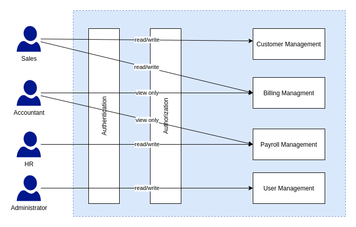

# CMS for Unboxing Community

## Features

- **Login**: User authentication and login functionality.
- **Customers Management**: operations for managing customer data.
- **Billings Management**: operations for managing billing information.
- **Payrolls Management**: operations for managing payroll data.
- **Users Management**: operations for managing user information.

## Project Structure

- **db/**: Contains the database models for billings, customers, payrolls, and users.
  - `billings.models.go`
  - `customers.model.go`
  - `init.go`
  - `payrolls.model.go`
  - `users.model.go`
- **routes/**: Contains the route handlers for different functionalities.
  - `billings.go`
  - `customers.go`
  - `login.go`
  - `payrolls.go`
  - `users.go`
- **main.go**: The entry point of the application.
- **docker-compose.yml**: Docker Compose configuration file.
- **go.mod**: Go module dependencies.
- **go.sum**: Go module dependency checksums.
- **.env**: Environment variables configuration file.

## Getting Started

### Prerequisites

- Docker
- Docker Compose

### Running the Application

To run the application, use the following command:

**`docker-compose up -d`**
